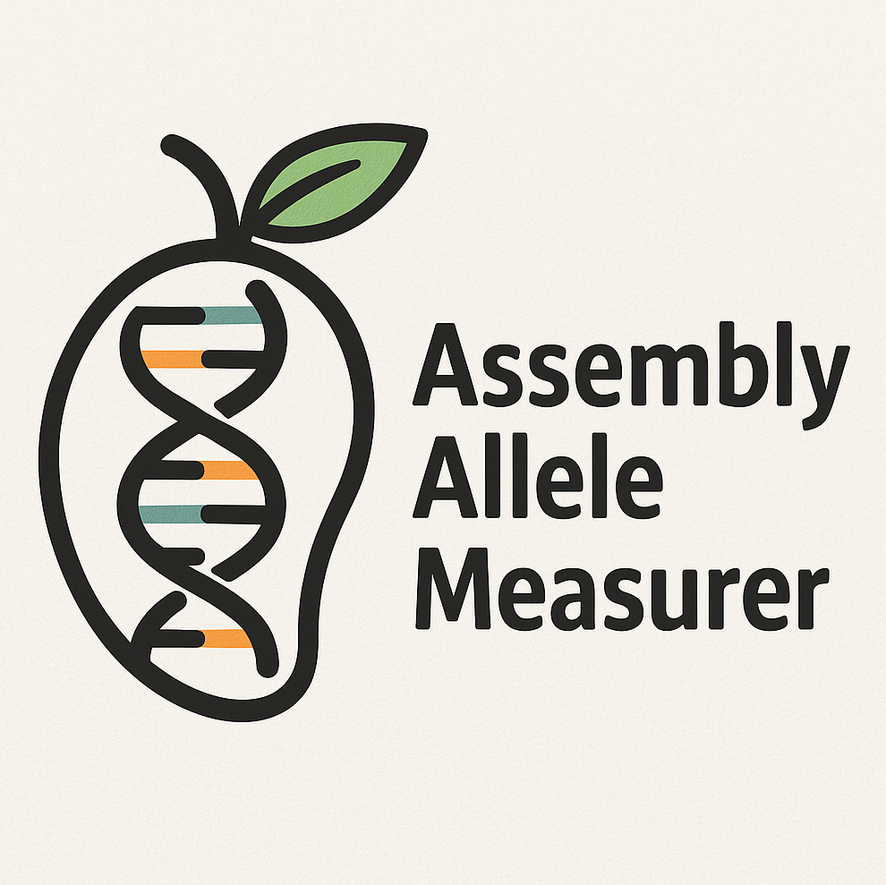

# AAM - Assembly Allele Measurer

<p align=center>
  
</p>

AAM (Assembly Allele Measurer) is a tool designed to extract and measure alleles from alignment files of genome assemblies, with a specific focus on tandem repeats. It calculates repeat alleles at defined loci using a BED file of target regions. 
The BED file should be based on the reference genome used for aligning the assembly.
For assembly-to-assembly alignment, tools like `minimap2` with the `-ax asm5` preset are recommended.<br>
**NOTE: It is recommended to provide separate BAM files for paternal and maternal alignments to obtain diploid alleles as separate outputs, rather than using a merged BAM file.**

## Usage
```bash
python aam.py -h
```
which gives the following output:
```
usage: aam [-h] -a <FILE> -l <FILE> [-o <STR>]

Required arguments:
  -a <FILE>, --aln <FILE>
                        Input BAM file
  -l <FILE>, --loci <FILE>
                        Input loci file in bgzipped and tabix format

Optional arguments:
  -o <STR>, --out <STR>
                        name of the output file, output is in bed format.
```
## Output columns
- The output begins with the same initial columns as provided in the input BED file.
- These are followed by three additional columns:
    1. Allele length
    2. Allele Sequence
    3. Number of supporting contigs(reads) for that allele.

## Example
```bash
python aam.py -a Paternal.bam -l TR_regions.bed.gz -o paternal_allele.bed
python aam.py -a Maternal.bam -l TR_regions.bed.gz -o maternal_allele.bed
```
If the `-o or --out` option is not specified, the output will be saved to `assembly_allele.bed` by default.
