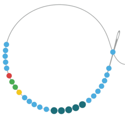

# Complex Tandem Repeat Simulator

A Python script for simulating tandem repeat sequences with configurable motif sizes, repeat lengths, interruptions, and compound repeats. Outputs FASTA and BED files for downstream analysis.

---

## Requirements

- Python 3.7+
- `tqdm`
- Custom modules: `interrupted_TR_simulation`, `compound_TR_simulation`
- Motif file: `motif-list.tsv` (must be present in the working directory)

Install dependencies:

```bash
pip install tqdm
```

---

## Usage

```bash
python main.py [OPTIONS]
```

Running without arguments prints the help message.

---

## Sequence Types

Exactly one sequence type flag should be provided:

| Flag | Description |
|---|---|
| `--pure` | Perfect tandem repeats with no fragments or mutations |
| `--point-mutation` | Pure repeats with point mutations applied |
| `--fragmented` | Repeats with fragmented motif structure (default behavior) |
| `--fragmented-with-mutations` | Fragmented repeats with additional point mutations |

---

## Options

| Flag | Default | Description |
|---|---|---|
| `-l`, `--num-locations` | `100` | Number of repeat loci to generate |
| `-o`, `--out-prefix` | random hex | Output filename prefix |
| `--purity` | `0.90` | Fraction of unmutated positions (used with `--point-mutation` or `--fragmented-with-mutations`) |
| `--min-motif-size` | `3` | Minimum motif length (bp) |
| `--max-motif-size` | `10` | Maximum motif length (bp) |
| `--min-repeat-length` | `50` | Minimum total repeat sequence length (bp) |
| `--max-repeat-length` | `200` | Maximum total repeat sequence length (bp) |
| `--no-fragment-fraction` | `0.2` | Fraction of sequences generated without fragmentation |

---

## Output Files

Two files are created per run, named `sim_<prefix>.fa` and `sim_<prefix>.bed`.

### FASTA (`sim_<prefix>.fa`)

Each entry contains the repeat ID, primary motif, and motif size in the header:

```
>R001;ACAT;4
ACATACAT...
```

### BED (`sim_<prefix>.bed`)

Tab-delimited with the following columns:

| Column | Description |
|---|---|
| 1 | Repeat ID |
| 2 | Start (always `0`) |
| 3 | End (sequence length) |
| 4 | Motif size |
| 5 | Primary motif |
| 6 | Structure summary |
| 7 | Number of fragments |
| 8 | Sequence length |
| 9 *(optional)* | Mutation info (`pos\|ref\|alt` records, semicolon-separated) |

---

## Examples

Generate 500 fragmented repeats:

```bash
python main.py --fragmented -l 500 -o my_run
```

Generate 200 pure repeats with motifs of size 4–6 bp:

```bash
python main.py --pure -l 200 --min-motif-size 4 --max-motif-size 6
```

Generate fragmented repeats with 95% purity (5% point mutations):

```bash
python main.py --fragmented-with-mutations --purity 0.95 -l 1000 -o mutated_run
```

---

## Motif File Format

The simulator reads motifs from `motifs-list.tsv`, a two-column TSV:

```
ACAT    4
ATCG    4
GCTAGC  6
```

Column 1 is the motif sequence; column 2 is its length. Only motifs within the specified `--min-motif-size` / `--max-motif-size` range are used.

---

## Module Dependencies

| Module | Role |
|---|---|
| `interrupted_TR_simulation` | Applies substitutions and updates mutation tracking |
| `compound_TR_simulation` | Generates repeat sequences with structural tracking |